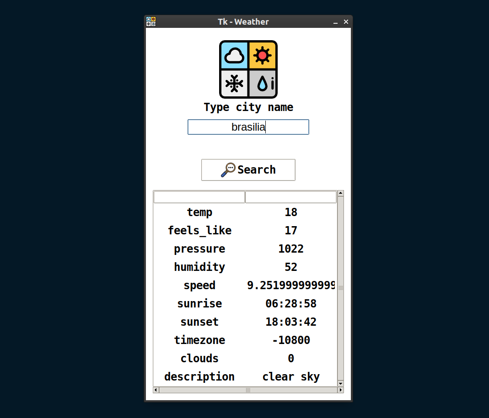

# API_Clima_Cidades
Projeto utilizando a biblioteca Tkinter do Python para se informar sobre o clima de uma determinada cidadeno mundo em tempo real por meio de uma API disponível no site https://openweathermap.org

## Como executar?

- instale as dependencias

    `python3 -m pip install -r requirements.txt`

- executar a aplicação

    `python3 main.py`

## screenshots

